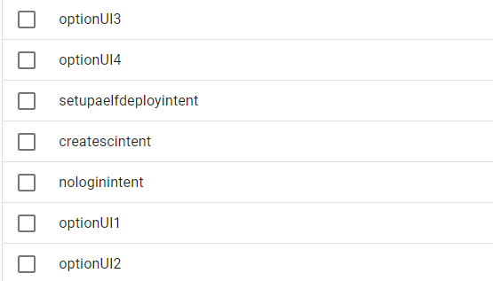

## aelfGenie Documentation

aelfGenie is an AI powered tool that enables developers interested in building on AELF Layer-1 blockchain to build Dapps Faster. The platform integrates various features, including smart contract code generation, optimization, deployment, and transaction data analysis.. The project leverages Google Cloud Platform (GCP) AI tools to enhance functionality and provide a seamless user experience.

This docs provides a groundlevel information about the tools powering aelfGenie and how you can use it:

### Four Main Features in aelfGenie:
**Smart Contract Generation**: generates ***Aelf Based Smart Contracts*** code based on User Description, categorization of user description for features suggestion, to create advanced and complex smart contracts.

**Optimization of SC:** Analyzes smart contract code to debug issues, Screens for known bugs and security exploits. It attempts to Upgrade(n optimise) smart contracts using Aelf Standards / Methods.

**Deployment workflow:** Assists with deploying smart contracts and debugging deployment issues. Works with you across all information necessary for Aelf Development.

**Exploration & Analysis:** Analyzes transaction data to identify high Gas/Sized transactions, Outliers, Smart Contract Activity Levels and more. This can provide Insights for Devs.

## GCP (google cloud platform) & AI Powered Tools Integration

**DialogflowCX(dfl):** AI assistant powering Intent-based conversation through app navigation. reponses are delivered with GCP cloud functions

**Cloud Functions** I have utilized this as my total backend for interaction with DFL Cx and Vertex Search AI Agent. It is further integrated with Big Query & Aelf public test node.

**Vertex Search Agent:** The agent has been trained(connected) to Aelf Deployment & General documentation for Generative responses. I have further trained it on external materials from public sites like github and stackoverflow.

**Big Query:**(***big query made me love sql***). Filled with a Cron scheduled Data Extracted from aelf public test node, big query allows analysis of this and response to frontend.

**Cloud Buckets:** An easy way to pre-store all documentations & data used w/ one-click connection

**OpenAI Model:** The model that aids in generating & optimizing SCs, utilizing a pretrained OpenAI GPT 4.0, with regex expression to process responses and code (back & forth)

### Open Source Libraries & Tools
* Next.js & Typescript
* Material UI
* Eden AI
* React Chart Js (for data visualization n advanced graphs)
* Monaco Editor (inbuilt code editor)

**NB: u can proceed to *how-to-use* here**

### Detailed Integration Steps
1. Dialogflow Cx is a hybrid AI Chat model, it can use predefined intent powered responses / on spur from database
- a new agent with intents defined(4 main UI features)/n
  
  
- trained on phrases that is auto fired by app
- connection with a webhook for feature suggestion (SC generation)
- webhook obtains user description, processes it based on keywords
- predefined features from a feature database, with random selection of two
- response is parsed into `fulfillment response` for DFL

  

2. Guided Generation & Optimization
- Guided generation for context (*model weight changes for every generation, so essential to guide for efficiency*)
- parameter fine tuning (low temp, and large generation possible) low temp ensures model adheres to my context
- the request is sent and parsed w/ conditions for Aelf Standards
- it must be uniquely aelf `chsarp` smart contracts (*a pretrained model finetuned on csharp can decide to generate solidity*)
- generation w/ aelf standards n methods are used (`TransferFrom`, `CreateProposalInput` etc)

3. Aelf Test Node Extraction and Big Query
- I have used aelf public test node for this feature (***https://tdvv-public-node.aelf.io***)
- The kind of data we will get is `blockHeight`
- A small cloud function to ping everyday, upload data to big query in this format
- Utilizing a GCP managed service key W/ permissions for  app&users to interact with cloud big query as admin
- on the front end, user can make three types of analysis, created SQL queries returning different header structures (advanced filters)
- Used react chart js to process the data in graph view W/ labels.

4. Frontend Web app
- Built a modern UI using Material-UI for interacting with the platform.
- created components for selecting analysis types, viewing results, and navigating through the deployment flow, generating & optimizing SCs.
- Ensured the UI is responsive (*on desktop*) and provides a rich, interactive experience for users.

### How to Use app
- describe the kind of smart contract you want to generate (be sure to key in keywords; ex token contract, nft contract etc). this way you can receive advanced feature suggestions.
- send the app to generate and wait for a few seconds. 
- get and copy your generated code

- you can futher optimise your generated smart contract, or tweak your initial generation with more consice description

> NB: use of aelfGenie advise that you have some sort of understanding about aelf development (beginner lvl at least). you must know how to use your smart contracts in an aelf protobuf project.
Furthermore, smart contracts generated are NOT fool proof and will require human reference before they can be deployed

